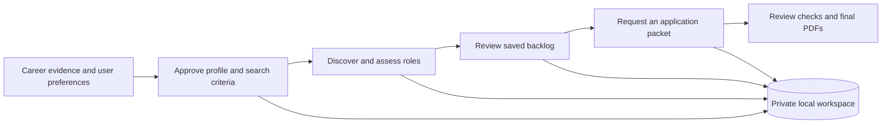

# Career Pipeline

**A local-first job-search workflow for Codex Desktop.**

Career Pipeline is a Codex Desktop plugin that helps people define their search, discover relevant roles, manage a backlog, and prepare tailored application materials. Career records stay in a folder the user controls. Research and writing use Codex; repeatable state changes and structural checks use Python helpers.

Created by **Ben Carroll**, with AI-assisted implementation and review through Codex. The beta has automated coverage; hiring outcomes, time savings, and independent user adoption have not been measured.

**v0.1.4 · macOS beta**

[Read the design notes](https://github.com/bentcarroll-cmyk/career-pipeline/blob/main/docs/design.md) · [Try the synthetic walkthrough](https://github.com/bentcarroll-cmyk/career-pipeline/blob/main/docs/demo.md) · [Download the release](https://github.com/bentcarroll-cmyk/career-pipeline/releases/tag/v0.1.4)

## The problem

A job search connects several kinds of work: explaining past experience, deciding which roles fit, checking live opportunities, and producing accurate applications. Disconnected chats and documents make it difficult to preserve decisions, avoid duplicate effort, and distinguish a draft from a completed action.

Career Pipeline gives that work an explicit sequence and a durable local record. It treats uncertainty, interrupted work, and the need for human judgment as design requirements.

## How it works



- **Onboard:** a resumable conversation produces a career profile and search criteria for the user to approve.
- **Discover:** available sources are checked against those criteria; results explain fit, gaps, and incomplete coverage.
- **Review:** saved roles retain stable identifiers and lifecycle history so decisions can be revisited.
- **Prepare:** an explicit request starts a tailored two-page résumé and optional one-page cover letter. Final-PDF fullness checks block sparse pages; factual, content-selection, text, and visual reviews remain required. See [resume quality](docs/resume-quality.md).

Discovery schedules are optional and require approval. Application preparation starts when requested. The plugin does not submit applications or contact employers.

## Design decisions

| Decision | Reason and tradeoff |
| --- | --- |
| Local records are authoritative | Users retain inspectable files; backups and multi-device access remain their responsibility. |
| Model work and deterministic helpers are separate | Codex handles research and writing; helpers handle identifiers, state transitions, receipts, and structural validation. Passing a helper check does not prove good writing. |
| Connectors are optional | The core workflow can operate without a specific external tracker; source availability still affects discovery. |
| Evidence and approval are recorded | Missing information and interrupted runs remain visible; review adds deliberate steps to the workflow. |
| Releases use allowlisted, reproducible archives | Runtime files are distributed separately from tests, development notes, and private user workspaces. |

The [design notes](https://github.com/bentcarroll-cmyk/career-pipeline/blob/main/docs/design.md) explain the implementation, tradeoffs, and validation limits.

## Evaluate the project

Start with the [synthetic walkthrough](https://github.com/bentcarroll-cmyk/career-pipeline/blob/main/docs/demo.md). It exercises local behavior without a personal résumé, connected accounts, live research, or employer outreach.

To try the plugin, download `career-pipeline-plugin.zip` and its `.sha256` file from [v0.1.4](https://github.com/bentcarroll-cmyk/career-pipeline/releases/tag/v0.1.4), then follow the [guided installation](docs/private-beta-installation.md). Repository invitations are no longer required. After installation, start a new Codex task and say **“Set up my job search.”**

The beta targets **Codex Desktop on macOS** and **Python 3.11+**. Native Windows is unsupported by the current workspace locking; Linux is unvalidated. The core helpers require no additional Python packages. Live discovery needs a web capability, and real application packets need document and PDF capabilities. A complete installation and real workflow on another person's Mac still need observation.

## Validation and limits

Automated tests cover state handling, approval boundaries, discovery evidence, application receipts, migration, privacy patterns, packaging, and a synthetic local journey. From a source checkout, using Python 3.11+:

```bash
python3 -m pip install '.[pdf]'
PYTHONPATH=src python3 -m unittest discover -s tests -v
python3 scripts/validate_plugin.py .
python3 scripts/scan_private_data.py .
```

These checks do not establish live source completeness, résumé quality, interview conversion, or usability on a new computer. PDF structure and recorded review receipts support editorial review; they do not replace it. Historical plans and review notes under `docs/` record development stages and may describe issues subsequently fixed.

## Privacy and reuse

The plugin has no hosted database, telemetry, or automatic feedback collection. The author receives no automatic copy of a user's workspace. Local storage does not mean all processing happens locally: Codex and any connected services process requests under their respective account settings and terms.

Keep your career workspace separate from the plugin checkout. **GitHub issues are public:** share redacted descriptions or synthetic examples, never résumés or private application files.

The [license](LICENSE) permits personal use and evaluation, including private modifications. Redistribution and commercial use require permission; this is source-available software. Your career information and application materials remain yours. Career Pipeline is an independent project and is not affiliated with or endorsed by OpenAI.

[Testing and feedback](docs/beta-testing.md) · [Safe upgrades](docs/private-beta-upgrades.md) · [Changelog](CHANGELOG.md) · [Maintainer release checks](docs/releasing.md)
