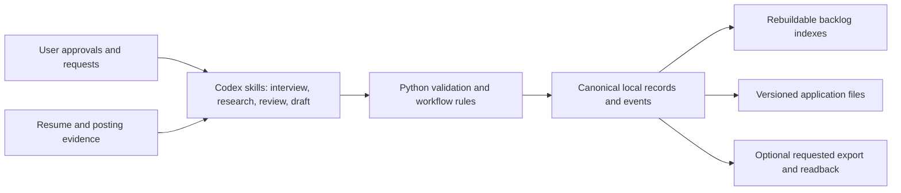

# Career Pipeline design

Created by Ben Carroll with Codex AI assistance.

Career Pipeline turns a personal job-search workflow into a reusable Codex Desktop plugin. It combines conversational research and drafting with a local record system, explicit user decisions, and checks that make work inspectable and resumable.

## Problem

A job search connects several different kinds of work: understanding a person's experience, assessing changing opportunities, choosing priorities, producing accurate documents, and tracking what actually happened. Automating those steps introduces operational risks: duplicate roles, unsupported résumé claims, missing source coverage, interrupted work, and confusing a prepared application with a submitted one.

## Design decisions

| Decision | Implemented behavior | Tradeoff |
| --- | --- | --- |
| Keep the user's workspace authoritative | Each opportunity has a stable `JOB-000123` folder; backlog and duplicate indexes can be rebuilt. | No shared hosted workspace; file consistency and recovery need explicit engineering. |
| Use AI for interpretation and deterministic helpers for state | Skills guide interviews, assessment, and drafting; Python handles normalization, identifiers, validation, persistence, and workflow transitions. | Structured checks cannot independently establish whether a written claim is true. |
| Preserve user control | Approved profile and criteria guide discovery; packet creation requires an explicit request; exports are optional. | Some useful steps remain deliberate user actions. |
| Make evidence and recovery visible | Assessments reference profile evidence, packet versions bind to inputs, and events and receipts preserve decisions. | More state and validation to maintain than a single conversational prompt. |

The [implementation specification](superpowers/specs/2026-09-11-career-pipeline-design.md) describes the workflow in detail. The [four skills](../skills) guide its conversational steps.

## Architecture

The [discovery path](../src/career_pipeline/discovery.py) validates reviewed batches against current approved profile and criteria hashes before saving them. The [assessment validator](../src/career_pipeline/evaluation.py) checks that positive claims reference an existing profile evidence ID. That establishes traceability; the model and reviewer must still judge whether the cited evidence supports the actual wording.

[Structured criteria](../src/career_pipeline/criteria.py) separate preferences from hard exclusions. Unknown or conflicting evidence remains unknown. A compensation range, an unstated travel expectation, or an application deadline must not silently become an unsupported exclusion.

The [job store](../src/career_pipeline/job_store.py) uses workspace locks, validated records, and recovery journals. [Packet workflows](../src/career_pipeline/packets.py) preserve historical versions and reject resumption when bound inputs have changed. Application preparation and delivery do not establish submission; [lifecycle reconciliation](../src/career_pipeline/reconciliation.py) uses separate evidence and routes ambiguity to review.

## Validation and limits

The [offline demo](demo.md) exercises synthetic discovery, duplicate handling, packet resumption, lifecycle updates, export readback, and index recovery. Its additional regressions cover stale assessments, preference boundaries, changed inputs, and unsupported packet scheduling. These are repeatable implementation checks.

Application quality also requires [factual, chronology, tailoring, text, page-count, and visual reviews](../skills/prepare-application/references/quality-gates.md). The code checks receipts and artifact bindings; a passing receipt does not itself perform editorial review. Synthetic test PDFs and asserted review receipts do not demonstrate the quality of a real tailored résumé.

Fresh-install usability, live source coverage, connector behavior, and real document quality need separate evaluation. The current target is Codex Desktop on macOS; native Windows locking is unsupported and Linux is unvalidated. Local storage also does not mean offline AI processing: Codex and optional services process the information used through their respective accounts.

The tests do not establish adoption, time savings, cost reduction, or application outcomes. Further evaluation could measure time to the first useful shortlist, missed duplicates, unsupported-claim corrections, and recovery after interruption against a defined baseline.
